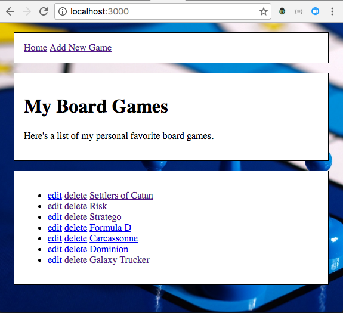

# Cruddy Board Games
This app stores a list of a board game names and their descriptions in an array
of objects in a local JSON file. The website supports basic CRUD operations
(create, read, update and delete) through a RESTful interface using HTTP methods
(GET, POST, PUT, DELETE).

HTML forms **DO NOT** support HTTP methods PUT and DELETE, so jQuery is used to
intercept user interactions when someone tries to submit an edit form or clicks
on a delete link. jQuery uses .preventDefault() to halt the normal action and
creates an AJAX request instead.

## Installation
1. Download the repo.
2. use 'npm install' to install dependencies
3. run `nodemon` to start the server
4. visit the page running at <http://localhost:3000>

## Task

Implement the routing for all the routes in the next section.

Suggested order of operations:

1. Do the GET routes first. Then, POST, PUT, DELETE.
2. For each route:
    1. Write the routing logic in `app.js`
    2. Create the template inside the folder `views/games/`
    3. Pass data from the route handler in `app.js` to the template (`res.render`)
    4. If required, listen for events in JS (`static/js/main.js`) and use AJAX

## Full RESTful Routing

| Verb | Path | Action | Used for |
|------|------|--------|----------|
| GET | /games | index | display a list of all games |
| GET | /games/new | new | return an HTML form for creating a new game |
| POST | /games | create | create a new game (using form data from /games/new) |
| GET | /games/:name | show | display a specific game |
| GET | /games/:name/edit | edit | return an HTML form for editing a game |
| PUT | /games/:name | update | update a specific game (using form data from /games/:name/edit) |
| DELETE | /games/:name | destroy | deletes a specific game |

## BONUS

* Use gamesWithNull.json instead of games.json. How will you make sure you're using an object instead of a null value?
* Replace synchronous I/O functions with asynchronous. (fs.readFile instead of fs.readFileSync)
* Use a database instead of `games.json`

## Licensing
All content is licensed under a CC­BY­NC­SA 4.0 license.
All software code is licensed under GNU GPLv3. For commercial use or alternative licensing, please contact legal@ga.co.
